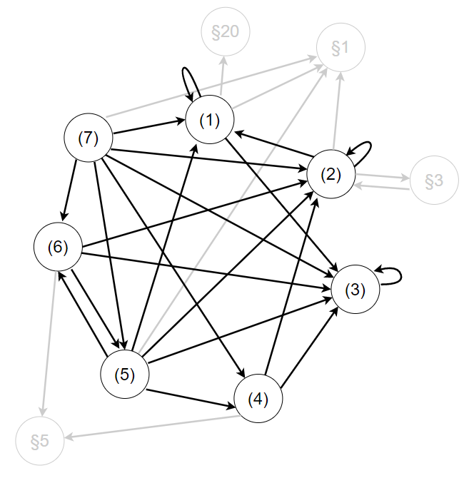

This is my first post on my Akademiekurs! How exciting!

I'm sure I'll write a lot more interesting things in the future.

Oh, and here's a great quote taken from
[wahlrecht.de](http://www.wahlrecht.de/).

> »Das Heil der Demokratien, von welchem Typus und Rang sie immer seien, 
> hängt von einer geringfügigen technischen Einzelheit ab: vom Wahlrecht. Alles andere ist sekundär.«
>
> (Jose Ortega y Gasset, span. Kulturphilosoph)

Wahlrecht is very fun. Look at this diagram about paragraph 6 of the Bundeswahlgesetz and its references between its clauses and to other paragraphs:

